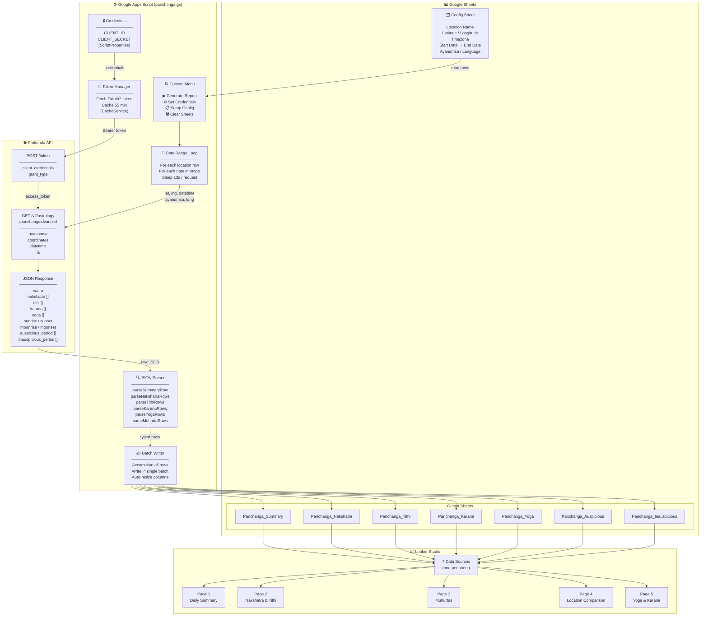

# Panchanga Application Architecture

```mermaid
flowchart TD
    subgraph GSheets["📊 Google Sheets"]
        Config["🗂 Config Sheet\n─────────────\nLocation Name\nLatitude / Longitude\nTimezone\nStart Date → End Date\nAyanamsa / Language"]

        subgraph OutputSheets["Output Sheets"]
            S1["Panchanga_Summary"]
            S2["Panchanga_Nakshatra"]
            S3["Panchanga_Tithi"]
            S4["Panchanga_Karana"]
            S5["Panchanga_Yoga"]
            S6["Panchanga_Auspicious"]
            S7["Panchanga_Inauspicious"]
        end
    end

    subgraph AppScript["⚙️ Google Apps Script  (panchanga.gs)"]
        Menu["🪐 Custom Menu\n─────────────\n▶ Generate Report\n⚙ Set Credentials\n📋 Setup Config\n🗑 Clear Sheets"]
        TokenCache["🔑 Token Manager\n─────────────\nFetch OAuth2 token\nCache 55 min\n(CacheService)"]
        Creds["🔒 Credentials\n─────────────\nCLIENT_ID\nCLIENT_SECRET\n(ScriptProperties)"]
        DateLoop["📅 Date Range Loop\n─────────────\nFor each location row\nFor each date in range\nSleep 13s / request"]
        Parser["🔍 JSON Parser\n─────────────\nparseSummaryRow\nparseNakshatraRows\nparseTithiRows\nparseKaranaRows\nparseYogaRows\nparseMuhurtaRows"]
        BatchWriter["✍️ Batch Writer\n─────────────\nAccumulate all rows\nWrite in single batch\nAuto-resize columns"]
    end

    subgraph ProkeralaAPI["🌐 Prokerala API"]
        TokenEndpoint["POST /token\n─────────────\nclient_credentials\ngrant_type"]
        PanchangEndpoint["GET /v2/astrology\n/panchang/advanced\n─────────────\nayanamsa\ncoordinates\ndatetime\nla"]
        APIResponse["JSON Response\n─────────────\nvaara\nnakshatra []\ntithi []\nkarana []\nyoga []\nsunrise / sunset\nmoonrise / moonset\nauspicious_period []\ninauspicious_period []"]
    end

    subgraph LookerStudio["📈 Looker Studio"]
        DS["7 Data Sources\n(one per sheet)"]
        P1["Page 1\nDaily Summary"]
        P2["Page 2\nNakshatra & Tithi"]
        P3["Page 3\nMuhurtas"]
        P4["Page 4\nLocation Comparison"]
        P5["Page 5\nYoga & Karana"]
    end

    %% Trigger flow
    Config -->|"read rows"| Menu
    Menu --> DateLoop
    Creds -->|"credentials"| TokenCache
    TokenCache -->|"Bearer token"| TokenEndpoint
    TokenEndpoint -->|"access_token"| PanchangEndpoint
    DateLoop -->|"lat, lng, datetime\nayanamsa, lang"| PanchangEndpoint
    PanchangEndpoint --> APIResponse
    APIResponse -->|"raw JSON"| Parser
    Parser -->|"typed rows"| BatchWriter
    BatchWriter --> S1
    BatchWriter --> S2
    BatchWriter --> S3
    BatchWriter --> S4
    BatchWriter --> S5
    BatchWriter --> S6
    BatchWriter --> S7

    %% Looker Studio connections
    S1 --> DS
    S2 --> DS
    S3 --> DS
    S4 --> DS
    S5 --> DS
    S6 --> DS
    S7 --> DS
    DS --> P1
    DS --> P2
    DS --> P3
    DS --> P4
    DS --> P5
```
